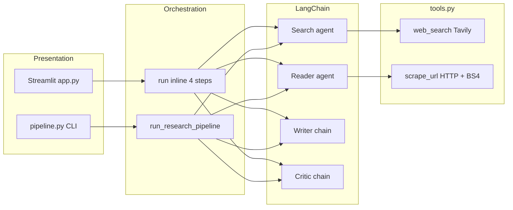
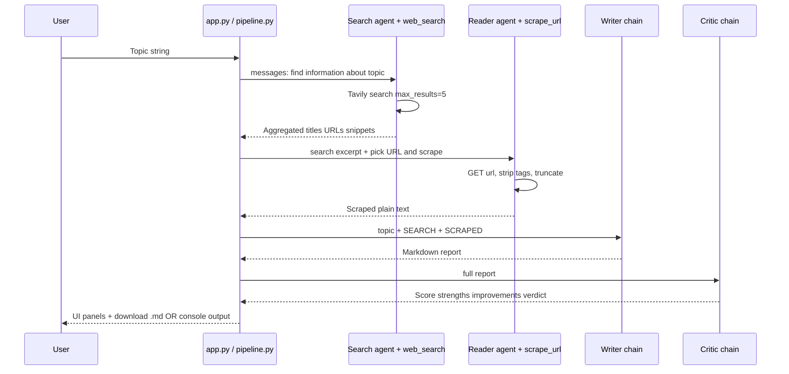

# ResearchMind

**ResearchMind** is a multi-step research assistant: specialized LangChain agents search the web, scrape a primary source, draft a structured Markdown report, and run a critic pass for quality feedback. You can run it as a **Streamlit app** or as a **CLI script**.

---

# Project Live Link

https://research-agent-lmxcfg5szeuqzouphuyt7g.streamlit.app/

## What it does

| Stage | Component | Responsibility |
|--------|-----------|----------------|
| 1 | **Search agent** | Uses [Tavily](https://tavily.com/) to find recent pages (titles, URLs, snippets). |
| 2 | **Reader agent** | Chooses a relevant URL from search output and **scrapes** full text (truncated) via HTTP + BeautifulSoup. |
| 3 | **Writer chain** | LLM turns search + scraped text into a structured report (intro, findings, conclusion, sources). |
| 4 | **Critic chain** | LLM scores the report and returns strengths, gaps, and a one-line verdict. |

The LLM stack in this repo is **[Groq](https://groq.com/)** (`llama-3.3-70b-versatile`) via `langchain-groq`. There is commented-out code in `agents.py` for **OpenAI** if you prefer to switch.

---

## Architecture (high level)



---

## End-to-end pipeline flow



---


**Implementation detail:** the reader step receives only the **first 800 characters** of search results (`app.py` / `pipeline.py`) to keep prompts bounded; the writer receives the **full** search text and full scraped content (up to tool limits).

---

## Repository layout

| File | Role |
|------|------|
| `app.py` | Streamlit UI: themed layout, session state, runs all four steps, shows expanders + download. |
| `pipeline.py` | Same logic for terminal use: `run_research_pipeline(topic)` and `__main__` prompt. |
| `agents.py` | Shared LLM (`ChatGroq`), `create_agent` for search/reader, LCEL chains for writer/critic. |
| `tools.py` | `@tool` functions: `web_search` (Tavily), `scrape_url` (requests + BeautifulSoup). |
| `requirements.txt` | Python dependencies. |
| `.gitignore` | Ignores `.env` (secrets stay local). |

---

## Prerequisites

- **Python 3.10+** (recommended; match your LangChain version).
- Accounts / API keys:
  - **Groq** — for `ChatGroq` (default).
  - **Tavily** — for `TAVILY_API_KEY`.
  - **OPEN AI** — for `OPENAI_API_KEY`. (optional)

---

## Setup

1. **Clone** the repository and enter the project directory.

2. **Create a virtual environment** (example):

   ```bash
   python -m venv .venv
   .venv\Scripts\activate
   ```

   On macOS/Linux: `source .venv/bin/activate`

3. **Install dependencies:**

   ```bash
   pip install -r requirements.txt
   ```

4. **Configure environment variables** — create a `.env` file in the project root (never commit it):

   ```env
   GROQ_API_KEY=your_groq_api_key
   TAVILY_API_KEY=your_tavily_api_key
   ```

   `ChatGroq` reads the Groq key from the environment (standard name: `GROQ_API_KEY`). `tools.py` loads `TAVILY_API_KEY` explicitly.

---

## How to run

### Web UI (Streamlit)

```bash
streamlit run app.py
```

Open the URL shown in the terminal (usually `http://localhost:8501`). Enter a topic, click **Run Research Pipeline**, wait for all four steps, then read the report, critic feedback, and optional **Download Report (.md)**.

### Command line

```bash
python pipeline.py
```

When prompted, enter a research topic. Step logs and outputs print to the console; the function returns a dict with keys: `search_results`, `scraped_content`, `report`, `feedback`.

---

## Configuration and customization

### Model provider

- **Current default:** Groq + `llama-3.3-70b-versatile` in `agents.py`.
- **Switch to OpenAI:** Uncomment the block at the top of `agents.py` and comment out the Groq block, install/configure `OPENAI_API_KEY`, and align `requirements.txt` if you drop Groq entirely.

### Search and scrape behavior

- **Tavily:** `max_results=5` in `tools.py` — adjust for broader or narrower search.
- **Scrape:** 8s timeout, custom `User-Agent`, text capped at **3000** characters after stripping scripts/styles/nav/footer.

### Report structure

Writer and critic formats are defined in `agents.py` (`writer_prompt` / `critic_prompt`). Edit those templates to change sections, tone, or critic rubric.

---

## Observability and UX notes (Streamlit)

- **Session state** keys: `results` (dict per step), `running`, `done`.
- After a run completes, raw search and scrape outputs appear in **expanders**; the report uses Streamlit Markdown rendering inside a styled panel.
- The pipeline runs **sequentially** in one request cycle once `running` is true (search → reader → writer → critic).

---

## Troubleshooting

| Symptom | Likely cause |
|---------|----------------|
| Auth error from Groq | Missing or invalid `GROQ_API_KEY` in `.env` or environment. |
| Tavily errors | Missing `TAVILY_API_KEY` or quota/rate limits. |
| Empty or poor scrape | Target site blocks bots, needs JS, or URL from search is wrong — reader relies on the model picking a URL and `requests` fetching HTML. |
| `ModuleNotFoundError` | Run `pip install -r requirements.txt` inside the active venv. |

---

## Acknowledgments

- [LangChain](https://www.langchain.com/) — agents and LCEL chains  
- [Streamlit](https://streamlit.io/) — UI  
- [Tavily](https://tavily.com/) — search API  
- [Groq](https://groq.com/) — fast LLM inference  
